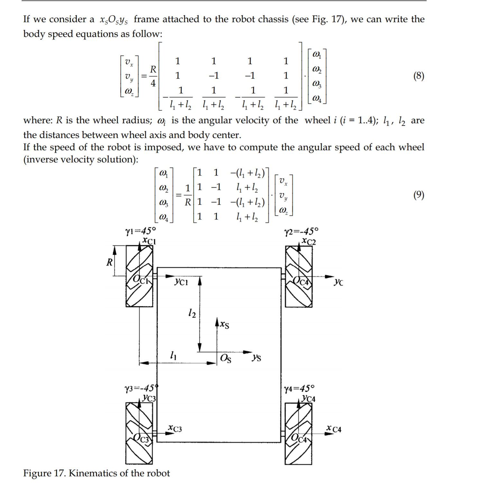

# checkpoint16
Kinematic model of ROSBot XL, an omnidirectional robot. 

## Simulation

    source ~/ros2_ws/install/setup.bash
    ros2 launch rosbot_xl_gazebo simulation.launch.py

Check if the robot can moves

    ros2 run teleop_twist_keyboard teleop_twist_keyboard

## Task 1
Test the holonomic movements
### Task 1 - terminal 1

    ros2 run wheel_velocities_publisher wheel_velocities_publisher

### Task 1 - terminal 2

    ros2 launch kinematic_model kinematic_model.launch.py

## Task 2 
Make the robot follow follows a 8 path

    ros2 launch eight_trajectory eight_trajectory.launch.py

### Knowledge
